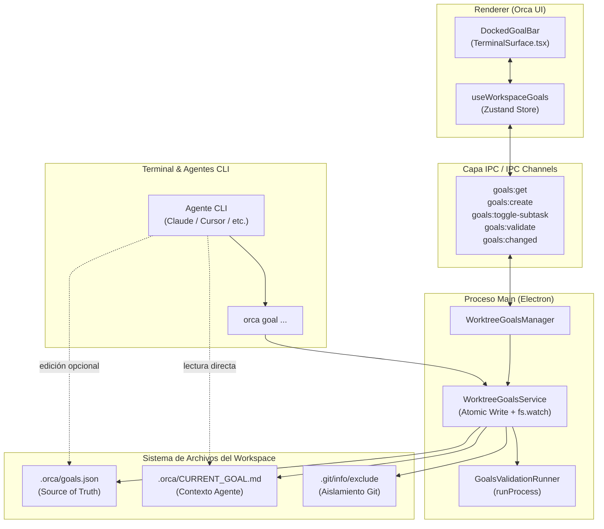

# Especificación Técnica: Controlador de Metas y Objetivos Locales

**Fecha:** 2026-10-07  
**Estado:** Aprobado para Planificación  
**Ruta de especificación:** `docs/superpowers/specs/2026-10-07-local-goals-controller-design.md`

---

## 1. Visión General y Propósito

El **Controlador de Metas Locales** (*Local Goals Controller*) es un subsistema desacoplado para Orca que permite a los desarrolladores definir, fraccionar, monitorizar y validar objetivos técnicos iterativos asociados al ciclo de vida de un espacio de trabajo o *worktree* de Git, sin requerir conexión ni dependencia de herramientas externas como Jira, Linear o GitHub Issues.

El sistema sirve de nexo entre la intención del usuario y la ejecución de agentes CLI (Claude Code, Cursor, Codex, etc.), sincronizando de forma transparente el contexto activo, facilitando la señalización de tareas completadas y ejecutando validaciones técnicas reproducibles en segundo plano.

---

## 2. Decisiones de Diseño y Arquitectura



### 2.1. Persistencia y Aislamiento por Workspace
* **Fuente de la Verdad (*Source of Truth*):** `<workspaceRoot>/.orca/goals.json`.
* **Aislamiento en Git:** Al inicializarse el servicio en un repositorio Git, Orca registra `.orca/` en `.git/info/exclude`. Esto garantiza que los archivos de metas no ensucien `git status`, no generen conflictos al cambiar de rama y no modifiquen el archivo `.gitignore` del proyecto.
* **Escritura Atómica:** El guardado de `.orca/goals.json` se realiza escribiendo primero en un archivo temporal (`.orca/goals.json.tmp`) seguido de un renombramiento atómico (`fs.promises.rename`), evitando lecturas corruptas por procesos concurrentes.
* **Proyección Reactiva para el Agente:** Cada mutación del estado proyecta inmediatamente el archivo de contexto legible para LLMs: `<workspaceRoot>/.orca/CURRENT_GOAL.md`.
* **Observador de Archivos (*Watcher*):** `WorktreeGoalsService` mantiene un `fs.watch` con debounce (150 ms) sobre `.orca/goals.json`. Si un agente CLI o el usuario edita el archivo externamente, el servicio valida la sintaxis, actualiza la caché en memoria y difunde el evento `goals:changed` a la UI.

---

## 3. Modelo de Datos y Esquemas

Ubicación: `src/shared/goals/goals-schema.ts`

```typescript
import { z } from 'zod'

export const GoalStatusSchema = z.enum([
  'pending',
  'in_progress',
  'in_verification',
  'completed',
  'failed'
])
export type GoalStatus = z.infer<typeof GoalStatusSchema>

export const GoalSubtaskSchema = z.object({
  id: z.string(),
  title: z.string().min(1),
  completed: z.boolean()
})
export type GoalSubtask = z.infer<typeof GoalSubtaskSchema>

export const GoalValidationSchema = z.object({
  command: z.string().min(1),
  status: z.enum(['idle', 'running', 'success', 'failed']),
  lastRunAt: z.number().optional(),
  exitCode: z.number().optional(),
  stdout: z.string().optional(),
  stderr: z.string().optional()
})
export type GoalValidation = z.infer<typeof GoalValidationSchema>

export const GoalSchema = z.object({
  id: z.string(),
  title: z.string().min(1),
  description: z.string().optional(),
  status: GoalStatusSchema,
  subtasks: z.array(GoalSubtaskSchema),
  validation: GoalValidationSchema.optional(),
  createdAt: z.number(),
  updatedAt: z.number()
})
export type Goal = z.infer<typeof GoalSchema>

export const WorkspaceGoalsDataSchema = z.object({
  activeGoalId: z.string().nullable(),
  goals: z.array(GoalSchema)
})
export type WorkspaceGoalsData = z.infer<typeof WorkspaceGoalsDataSchema>
```

---

## 4. Inyección de Contexto al Agente: `.orca/CURRENT_GOAL.md`

Generado automáticamente por `WorktreeGoalsService.projectActiveGoalFile()`:

```markdown
# Objetivo Activo: [Título de la Meta]
**Estado:** En curso
**ID:** [id]

## Descripción
[Descripción detallada de la meta]

## Subtareas
- [x] 1. Primera tarea completada
- [ ] 2. Segunda tarea pendiente (siguiente paso)
- [ ] 3. Tercera tarea pendiente

## Validación Técnica
- Comando: `[comando de validación]`
- Estado: No ejecutado | Exitoso | Fallido

---
*Nota para el agente: Puedes marcar subtareas ejecutando `orca goal complete <id-o-índice>` o editando `.orca/goals.json`. Para validar formalmente, ejecuta `orca goal validate`.*
```

---

## 5. Proceso Main y Motor de Validación

### 5.1. `WorktreeGoalsManager` (`src/main/goals/worktree-goals-manager.ts`)
* Singleton que gestiona instancias de `WorktreeGoalsService` por `workspacePath`.
* Libera *watchers* y recursos al cerrarse un workspace.

### 5.2. `GoalsValidationRunner` (`src/main/goals/goals-validation-runner.ts`)
* Lanza el comando de validación usando `runProcess` (`src/shared/child-process/`) en el directorio del workspace (`cwd: workspacePath`).
* Respeta las reglas multiplataforma de Orca (`windowsHide: true`, sin `shell: true`, resolución de `.cmd`/`.bat` shims).
* Aplica un timeout preventivo (5 minutos por defecto).
* Trunca las salidas `stdout` y `stderr` a un máximo de 50 KB para evitar degradación de memoria.
* Actualiza el estado de la meta y re-proyecta `CURRENT_GOAL.md` con los resultados.

### 5.3. Contrato IPC (`src/shared/goals/goals-ipc.ts`)
* Canales tipados:
  * Invocación: `goals:get`, `goals:create-goal`, `goals:set-active`, `goals:toggle-subtask`, `goals:update-goal`, `goals:run-validation`.
  * Evento hacia Renderer: `goals:changed`.

---

## 6. Integración con el CLI de Orca (`orca goal ...`)

Ubicación: `src/cli/specs/goals.ts` y despacho en `src/cli/dispatch.ts`.

* `orca goal status [--json]`: Consulta la meta activa y subtareas.
* `orca goal complete <id-o-índice>`: Marca la tarea correspondiente como completada.
* `orca goal validate`: Ejecuta la validación técnica configurada y muestra el resultado en stdout/stderr.
* `orca goal add-task "<título>"`: Añade una nueva subtarea a la meta activa.

Resolución de contexto: Resuelve el workspace mediante la variable de entorno `ORCA_CLI_CWD` o `process.cwd()`.

---

## 7. Interfaz de Usuario: Barra de Metas Acoplada (`DockedGoalBar`)

Ubicación: `src/renderer/src/components/goals/DockedGoalBar.tsx` montado en `src/renderer/src/components/TerminalSurface.tsx`.

* **Diseño y Estilo:** Cumple estrictamente con `STYLEGUIDE.md`, utilizando tokens estándar y componentes de `src/renderer/src/components/ui/` (`DropdownMenu`, `Tooltip`, `Popover`, `Checkbox`, `Button`, `Badge`).
* **Cabecera y Selector:**
  * Selector desplegable para alternar la meta activa o crear una nueva.
  * Badge de estado operativo.
* **Barra de Progreso Segmentada:**
  * Dividida visualmente en $N$ segmentos iguales (uno por subtarea).
  * Segmentos completados con color de acento (`bg-primary`); pendientes con `bg-muted/50`.
  * Tooltip con el nombre de cada subtarea al pasar el cursor.
* **Panel de Subtareas Desplegable:**
  * Popover con checkboxes interactivos para marcar/desmarcar manualmente.
  * Campo de entrada rápido para añadir nuevas tareas.
* **Semáforo de Validación:**
  * Píldora interactiva con estados de color: Verde (éxito), Rojo (fallo), Gris (inactivo), Azul con animación (ejecutando).
  * Al pasar el ratón / hacer clic, muestra un `Popover` monospace con el comando y los logs formateados.
  * Botón directo para re-ejecutar.
* **Botón de Asistencia Rápida:**
  * Redacta la instrucción con la siguiente tarea pendiente.
  * Inyecta el texto directamente en el prompt del terminal activo de ese worktree sin ejecutar (`\r`), permitiendo al usuario revisar y dar Enter.

---

## 8. Gestión de Casos Extremos

1. **Ediciones concurrentes de archivo:** Si el agente escribe en `goals.json` mientras el usuario interactúa con la UI, las escrituras atómicas evitan archivos truncados, y el *file watcher* sincroniza la UI de inmediato.
2. **JSON malformado por el agente:** Si la sintaxis de `goals.json` queda rota, el parser registra el error en logs, mantiene intacta la copia en memoria y no sobrescribe el archivo para evitar pérdida de datos.
3. **Workspaces sin Git / Folder Workspaces:** El sistema verifica si existe el directorio `.git`; si no existe, omite la actualización de `.git/info/exclude` y opera de forma segura dentro de `.orca/`.
4. **Validaciones en bucle o colgadas:** Timeout por defecto de 5 minutos y rechazo de ejecuciones paralelas concurrentes sobre la misma meta.

---

## 9. Estrategia de Pruebas y Verificación

* **Pruebas unitarias de esquemas y parsing:** `src/shared/goals/goals-schema.test.ts`.
* **Pruebas de servicio y atomicidad de archivos:** `src/main/goals/worktree-goals-service.test.ts` (creación de directorios, escrituras atómicas, detección de cambios por watcher).
* **Pruebas del motor de validación:** `src/main/goals/goals-validation-runner.test.ts` (procesos con salida exitosa y fallida, límites de tamaño en stdout/stderr).
* **Pruebas de CLI:** `src/cli/specs/goals.test.ts` y despacho de subcomandos.
* **Pruebas de componentes de UI:** `src/renderer/src/components/goals/DockedGoalBar.test.tsx` (renderizado de segmentos, interacción de checkboxes, popover de logs).
