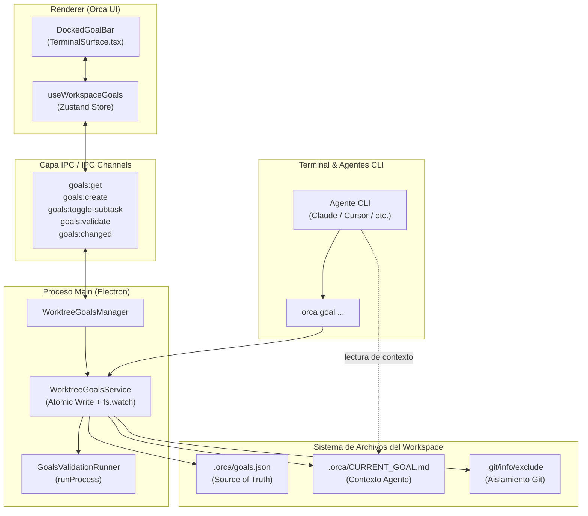

# Especificación Técnica: Controlador de Metas y Objetivos Locales

**Fecha:** 2026-10-07  
**Estado:** Aprobado para Planificación  
**Ruta de especificación:** `docs/superpowers/specs/2026-10-07-local-goals-controller-design.md`

---

## 1. Visión General y Propósito

El **Controlador de Metas Locales** (*Local Goals Controller*) es un subsistema desacoplado para Orca que permite a los desarrolladores definir, fraccionar, monitorizar y validar objetivos técnicos iterativos asociados al ciclo de vida de un espacio de trabajo o *worktree* de Git, sin requerir conexión ni dependencia de herramientas externas como Jira, Linear o GitHub Issues.

El sistema sirve de nexo entre la intención del usuario y la ejecución de agentes CLI (Claude Code, Cursor, Codex, etc.), sincronizando de forma transparente el contexto activo, facilitando la señalización de tareas completadas y ejecutando validaciones técnicas reproducibles en segundo plano.

---

## 2. Decisiones de Diseño y Arquitectura



### 2.1. Persistencia y Aislamiento por Workspace
* **Fuente de la Verdad (*Source of Truth*):** `<workspaceRoot>/.orca/goals.json`.
* **Aislamiento en Git (Soporte Linked Worktrees y Repos Estándar):**
  * Al inicializarse el servicio, Orca no asume que `.git` sea un directorio. Para resolver la ruta correcta del archivo de exclusión, ejecuta:
    ```bash
    git rev-parse --git-path info/exclude
    ```
    (o en fallback inspecciona si `.git` es un archivo con `gitdir: <path>` hacia el directorio administrativo del worktree).
  * Orca registra `.orca/` dentro del archivo resuelto. Esto garantiza compatibilidad tanto en repositorios normales como en *linked worktrees* (`git worktree add`), sin causar errores `ENOTDIR` y manteniendo `git status` limpio sin tocar `.gitignore`.
  * En *folder workspaces* (sin Git), se omite este paso y el directorio `.orca/` opera localmente.
* **Escritura Atómica y Cola de Mutaciones:**
  * Toda modificación en `goals.json` pasa por una cola serializada (*mutation mutex*) en el proceso Main.
  * La persistencia en disco escribe en un archivo temporal (`.orca/goals.json.tmp`) y renombra atómicamente (`fs.promises.rename`).
* **Supresión de Bucles de Eventos (*Feedback Loop Protection*):**
  * Al escribir el archivo, `WorktreeGoalsService` registra en memoria el hash criptográfico (SHA-256) del contenido escrito (`lastWrittenContentHash`).
  * Cuando el observador `fs.watch` detecta una modificación en disco, calcula el hash del archivo actual. Si coincide con `lastWrittenContentHash`, el evento se descarta inmediatamente, evitando recargas redundantes y emisiones en bucle de `goals:changed` hacia la UI.
* **Proyección Reactiva para el Agente:**
  * Cada mutación confirmada proyecta inmediatamente el archivo de contexto para LLMs: `<workspaceRoot>/.orca/CURRENT_GOAL.md`.

---

## 3. Modelo de Datos y Esquemas

Ubicación: `src/shared/goals/goals-schema.ts`

```typescript
import { z } from 'zod'

export const GoalStatusSchema = z.enum([
  'pending',
  'in_progress',
  'in_verification',
  'completed',
  'failed'
])
export type GoalStatus = z.infer<typeof GoalStatusSchema>

export const GoalSubtaskSchema = z.object({
  id: z.string(),
  title: z.string().min(1),
  completed: z.boolean()
})
export type GoalSubtask = z.infer<typeof GoalSubtaskSchema>

export const GoalValidationSchema = z.object({
  command: z.string().min(1),
  status: z.enum(['idle', 'running', 'success', 'failed']),
  lastRunAt: z.number().optional(),
  exitCode: z.number().optional(),
  summaryTail: z.string().optional() // Últimas 5-10 líneas del log para contexto rápido
})
export type GoalValidation = z.infer<typeof GoalValidationSchema>

export const GoalSchema = z.object({
  id: z.string(),
  title: z.string().min(1),
  description: z.string().optional(),
  status: GoalStatusSchema,
  subtasks: z.array(GoalSubtaskSchema),
  validation: GoalValidationSchema.optional(),
  createdAt: z.number(),
  updatedAt: z.number()
})
export type Goal = z.infer<typeof GoalSchema>

export const WorkspaceGoalsDataSchema = z.object({
  activeGoalId: z.string().nullable(),
  goals: z.array(GoalSchema)
})
export type WorkspaceGoalsData = z.infer<typeof WorkspaceGoalsDataSchema>
```

---

## 4. Inyección de Contexto al Agente: `.orca/CURRENT_GOAL.md` y Gestión de Tokens

Para evitar la saturación de la ventana de contexto del LLM (~12.000 tokens por 50 KB de logs), el resultado de la validación se divide en dos niveles:
1. **Resumen ligero en `CURRENT_GOAL.md`:** Solo incluye el estado, el código de salida y un extracto de las últimas 5–10 líneas de error (~300 bytes).
2. **Registro completo en `.orca/last_validation.log`:** Contiene la salida completa de `stdout` y `stderr` para inspección bajo demanda.

Además, **se prohíbe explícitamente al agente editar `goals.json` directamente**, canalizando todas las mutaciones a través del CLI de Orca para garantizar validación con esquemas Zod y prevenir corrupción de JSON.

### Formato generado de `.orca/CURRENT_GOAL.md`:

```markdown
# Objetivo Activo: [Título de la Meta]
**Estado:** En curso
**ID:** [id]

## Descripción
[Descripción detallada de la meta]

## Subtareas
- [x] 1. Primera tarea completada
- [ ] 2. Segunda tarea pendiente (siguiente paso)
- [ ] 3. Tercera tarea pendiente

## Validación Técnica
- Comando: `[comando de validación]`
- Estado: Exitoso | Fallido (exit code: 1)
- Resumen del error (últimas líneas):
```text
[Extracto de las últimas 5-10 líneas de error si falló]
```
*(Log completo disponible en `.orca/last_validation.log` si se requiere depuración detallada)*

---
> ⚠️ **REGLA PARA EL AGENTE:** NO modifiques manualmente el archivo `.orca/goals.json`.
> Para marcar tareas completadas ejecuta: `orca goal complete <id-o-índice>`.
> Para añadir nuevas tareas ejecuta: `orca goal add-task "<título>"`.
> Para validar el objetivo ejecuta: `orca goal validate`.
```

---

## 5. Proceso Main y Motor de Validación

### 5.1. `WorktreeGoalsManager` (`src/main/goals/worktree-goals-manager.ts`)
* Singleton que gestiona instancias de `WorktreeGoalsService` por `workspacePath`.
* Mantiene la cola de mutaciones y libera los *watchers* de archivos cuando se cierra un espacio de trabajo.

### 5.2. `GoalsValidationRunner` (`src/main/goals/goals-validation-runner.ts`)
* **Resolución de Comandos con Intérprete Shell Seguro:**
  * Los comandos de validación definidos por el usuario (ej. `pnpm test && pnpm lint`) requieren evaluación de shell (operadores lógicos `&&`, `|`, pipes y variables de entorno).
  * Para mantener `shell: false` a nivel de Node y respetar las políticas de `runProcess` (`src/shared/child-process/`, `windowsHide: true`), el comando se invoca pasando el intérprete de shell de la plataforma como programa explícito:
    * **Windows:** `{ program: process.env.COMSPEC || 'cmd.exe', args: ['/d', '/s', '/c', command], cwd: workspacePath }`
    * **macOS / Linux:** `{ program: '/bin/sh', args: ['-c', command], cwd: workspacePath }`
* **Persistencia de Logs y Resumen:**
  * Vuelca la salida completa en `<workspaceRoot>/.orca/last_validation.log`.
  * Extrae las últimas 5–10 líneas de salida relevante para el campo `summaryTail`.
* **Protección contra Procesos Bloqueados:**
  * Timeout preventivo de 5 minutos por defecto.
  * Cancela cualquier validación previa si el usuario o agente solicita una nueva ejecución sobre la misma meta.

### 5.3. Contrato IPC (`src/shared/goals/goals-ipc.ts`)
* Invocaciones:
  * `goals:get(worktreePath)` $\rightarrow$ `WorkspaceGoalsData`
  * `goals:create-goal(worktreePath, goalDraft)` $\rightarrow$ `Goal`
  * `goals:set-active(worktreePath, goalId)` $\rightarrow$ `void`
  * `goals:toggle-subtask(worktreePath, goalId, subtaskId, completed)` $\rightarrow$ `void`
  * `goals:update-goal(worktreePath, goalId, updates)` $\rightarrow$ `void`
  * `goals:run-validation(worktreePath, goalId)` $\rightarrow$ `GoalValidation`
* Evento hacia Renderer:
  * `goals:changed(worktreePath, WorkspaceGoalsData)`

---

## 6. Integración con el CLI de Orca (`orca goal ...`)

Ubicación: `src/cli/specs/goals.ts` y despacho en `src/cli/dispatch.ts`.

* `orca goal status [--json]`: Consulta la meta activa y subtareas.
* `orca goal complete <id-o-índice>`: Marca la tarea correspondiente como completada.
* `orca goal validate`: Ejecuta la validación técnica configurada y muestra el resultado en stdout/stderr.
* `orca goal add-task "<título>"`: Añade una nueva subtarea a la meta activa.

Resolución de contexto: Resuelve el workspace mediante la variable de entorno `ORCA_CLI_CWD` o `process.cwd()`.

---

## 7. Interfaz de Usuario: Barra de Metas Acoplada (`DockedGoalBar`)

Ubicación: `src/renderer/src/components/goals/DockedGoalBar.tsx` montado en `src/renderer/src/components/TerminalSurface.tsx`.

* **Diseño y Estilo:** Cumple estrictamente con `STYLEGUIDE.md`, utilizando tokens estándar y componentes de `src/renderer/src/components/ui/` (`DropdownMenu`, `Tooltip`, `Popover`, `Checkbox`, `Button`, `Badge`).
* **Cabecera y Selector:**
  * Selector desplegable para alternar la meta activa o crear una nueva.
  * Badge de estado operativo.
* **Barra de Progreso Segmentada:**
  * Dividida visualmente en $N$ segmentos iguales (uno por subtarea).
  * Segmentos completados con color de acento (`bg-primary`); pendientes con `bg-muted/50`.
  * Tooltip con el nombre de cada subtarea al pasar el cursor.
* **Panel de Subtareas Desplegable:**
  * Popover con checkboxes interactivos para marcar/desmarcar manualmente.
  * Campo de entrada rápido para añadir nuevas tareas.
* **Semáforo de Validación:**
  * Píldora interactiva con estados de color: Verde (éxito), Rojo (fallo), Gris (inactivo), Azul con animación (ejecutando).
  * Al pasar el ratón / hacer clic, muestra un `Popover` monospace con el comando y los logs formateados.
  * Botón directo para re-ejecutar.
* **Botón de Asistencia Rápida:**
  * Redacta la instrucción con la siguiente tarea pendiente.
  * Inyecta el texto directamente en el prompt del terminal activo de ese worktree sin ejecutar (`\r`), permitiendo al usuario revisar y dar Enter.

---

## 8. Gestión de Casos Extremos

1. **Linked Worktrees y Folder Workspaces:**
   * En worktrees secundarios (`.git` es un archivo plano apuntando a `gitdir`), `git rev-parse --git-path info/exclude` resuelve el archivo de exclusión real sin asumir que `.git` sea un directorio, previniendo errores `ENOTDIR`.
   * En repositorios o carpetas sin Git (*folder workspaces*), se omite la interacción con Git y el directorio `.orca/` opera puramente como almacenamiento local.
2. **Prevención de Bucles de Watcher y Lost Updates:**
   * Cada escritura de `goals.json` en Main actualiza `lastWrittenContentHash`. El watcher de `fs.watch` descarta eventos si el hash del contenido en disco coincide con la versión emitida por Orca.
   * La cola de mutaciones serializa escrituras concurrentes desde la UI y peticiones IPC/CLI.
3. **Consumo Eficiente de Tokens en LLMs:**
   * Para no inundar la ventana de contexto de los agentes CLI (~12.000 tokens por 50 KB de logs), `CURRENT_GOAL.md` solo expone el estado y un extracto de 5–10 líneas de error (`summaryTail`). El volcado íntegro de la consola se preserva en `.orca/last_validation.log`.
4. **Integridad de Esquemas (Agente CLI-Only):**
   * El archivo `CURRENT_GOAL.md` prohíbe explícitamente la edición directa de `goals.json` al agente, canalizando todas las mutaciones a través de `orca goal complete` o `orca goal add-task`, asegurando validación estricta con Zod en cada paso.
5. **Validaciones en Bucle o Colgadas:**
   * Timeout preventivo de 5 minutos en el subproceso de shell y rechazo de ejecuciones paralelas concurrentes sobre la misma meta.

---

## 9. Estrategia de Pruebas y Verificación

* **Pruebas unitarias de esquemas y parsing:** `src/shared/goals/goals-schema.test.ts`.
* **Pruebas de servicio y atomicidad de archivos:** `src/main/goals/worktree-goals-service.test.ts` (creación de directorios, escrituras atómicas, detección de cambios por watcher).
* **Pruebas del motor de validación:** `src/main/goals/goals-validation-runner.test.ts` (procesos con salida exitosa y fallida, límites de tamaño en stdout/stderr).
* **Pruebas de CLI:** `src/cli/specs/goals.test.ts` y despacho de subcomandos.
* **Pruebas de componentes de UI:** `src/renderer/src/components/goals/DockedGoalBar.test.tsx` (renderizado de segmentos, interacción de checkboxes, popover de logs).
